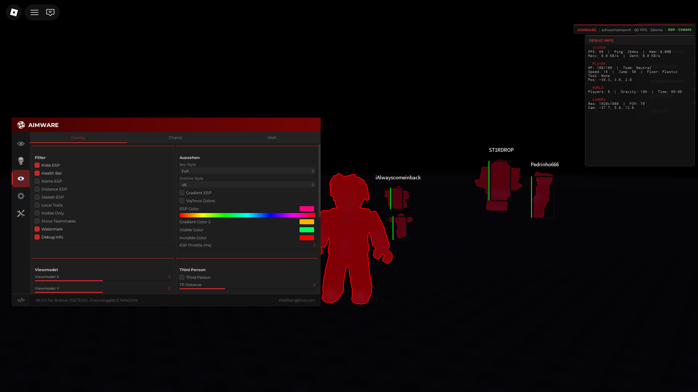
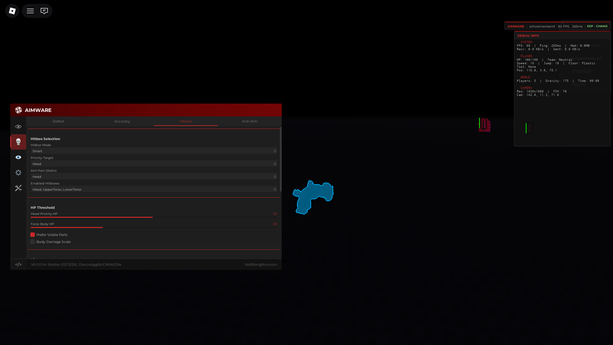
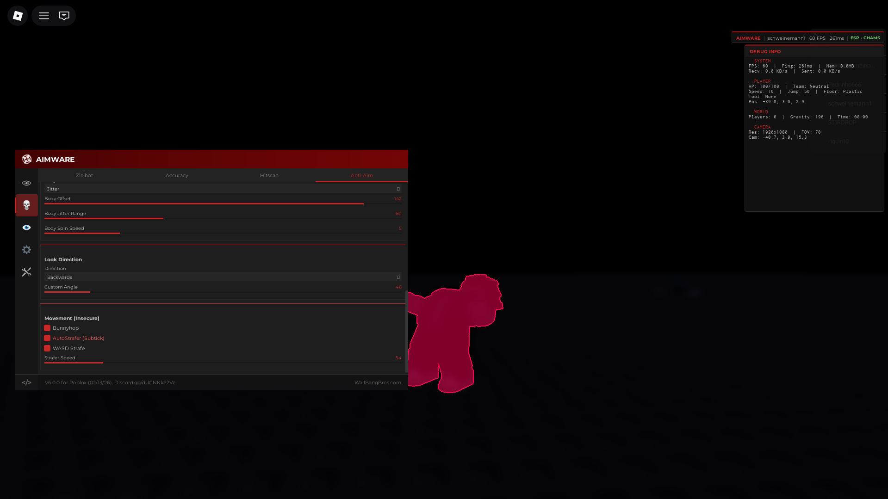
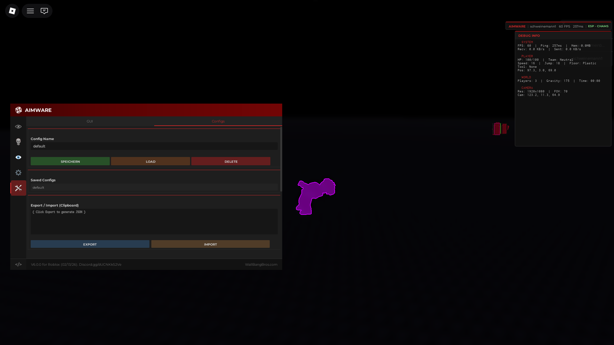

# AIMWARE V6 for Roblox

**Dominate the competition with the most advanced, feature-rich script for Roblox.**
Inspired by the legendary Aimware V6, this software brings a premium cheating experience to Roblox with a pixel-perfect GUI, advanced Ragebot technology, and stunning visuals.

---

## ✨ Feature Highlights

*   **Premium V6 GUI**: A faithful recreation of the Aimware V6 desktop interface, featuring smooth animations, drag-and-drop interaction, and a fully custom design system.
*   **Advanced Ragebot**: Dominate HvH servers with industry-leading prediction, resolver logic, and customizable anti-aim.
*   **Legitbot**: Play subtly with humanized aim assistance and smoothing.
*   **Visuals**: See everything with highly configurable ESP, Chams, and World effects.
*   **Cloud Configs**: Save and load your settings instantly.

---

## 🎯 Legitbot

Designed for subtle assistance, the Legitbot helps you hit your shots while looking completely natural.

*   **Aimbot**: Smooth camera assistance that tracks targets within a defined FOV.
*   **Triggerbot**: Automatically fires when your crosshair is over an enemy.
*   **Weapon Configs**: Customize settings for different weapon types.
*   **Semirage**: A hybrid mode offering "Silent Aim" functionality without the aggression of the full Ragebot.
    *   **Silent Aim**: Redirects bullets to the target without moving your camera.
    *   **Hit Chance**: Configurable randomization to mimic human error.

---

## 💀 Ragebot

For when subtlety isn't an option. The Ragebot is built for aggressive play and "Hack vs Hack" (HvH) scenarios.

### Aimbot & Targeting
*   **Silent Aim**: Fires at targets perfectly without locking your camera view.
*   **Auto Fire**: Automatically handles shooting with "Smart Hold" or classic modes.
*   **Resolver**: specialized logic to hit moving or anti-aiming targets.
*   **Prediction**: Advanced velocity prediction to hit targets even with high ping.
*   **Multi-Point Targeting**: Scans multiple hitboxes (Head, Chest, Arms, Legs) to find the best visible point.

### Anti-Aim
Make yourself harder to hit with advanced character manipulation.
*   **Pitch Manipulation**: Down, Up, Jitter, and Custom angles.
*   **Yaw Customization**: Spin, Jitter, Switch, and target-based logic to desync your hitbox.
*   **Desync**: Manipulates your real character position vs. visual position.
*   **Visualizer**: See your own anti-aim in third-person view.

---

## 👁️ Visuals

Enhance your awareness with beautiful, performant ESP and world modifications.

### Player ESP
*   **Box & Name**: Clean 2D boxes (Corner/Full) with health bars and wave-animated text.
*   **Skeleton**: Detailed bone overlays showing player posture.
*   **Chams**: See players through walls with customizable "Visible" and "Invisible" colors.
*   **Offscreen Arrows**: Indicators for enemies outside your field of view.

### World & Screen
*   **Night Mode & Ambience**: Fully custom lighting, sky removal, and color grading.
*   **Bullet Tracers**: Visualize bullet paths with rainbow or static colors.
*   **Third Person**: Custom third-person camera with anti-aim visualization.
*   **FOV Circle**: Visual representation of your aimbot's targeting radius.

---

## ⚙️ Misc & Settings

### Miscellaneous Features
*   **Movement**: Bunnyhop, Autostrafer (WASD/Forward), and Fly.
*   **Combat**: Spinbot, Anti-Knife, and various fun "Troll" features (Fling, Orbit, etc.).
*   **Utility**: Server Hopper, Fullbright, and an internal Script Executor.

### Configuration System
*   **Cloud Manager**: Easily Save, Load, and Delete configs.
*   **Clipboard Support**: Export your config to text to share with friends.
*   **Keybind System**: rapidly toggle features with custom hotkeys, displayed in an on-screen Keybind List.

---

## 🚀 Getting Started

1.  Execute the script using your preferred executor.
2.  Press **RightShift** to open the menu.
3.  Configure your settings or load a preset.
4.  Dominate.

---

*Educational Purpose Only. Use at your own risk.*
