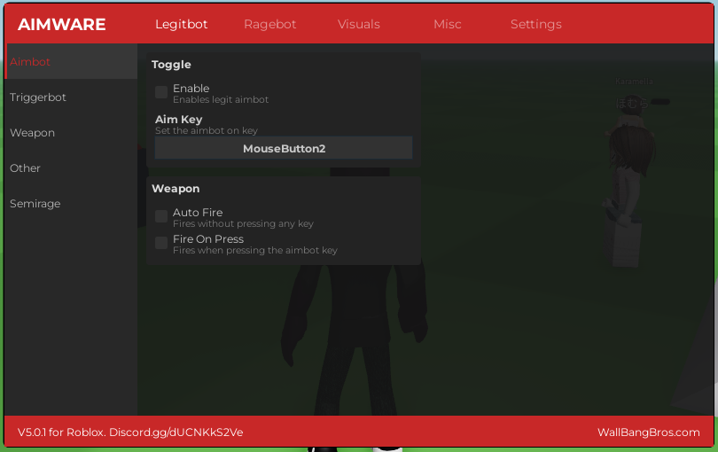
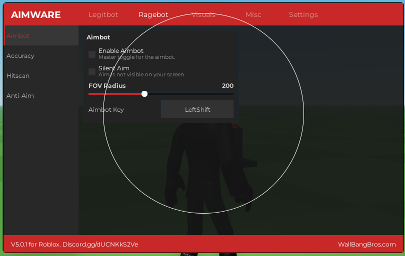
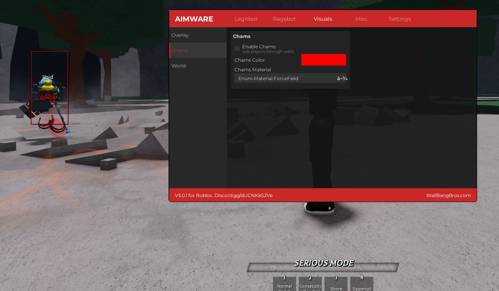

# Aimware v5.0.2 for Roblox

A universal cheat menu for Roblox, inspired by the legendary CS:GO cheat, **Aimware.net**. This is a fan project dedicated to recreating the classic Aimware experience within the Roblox engine. This script is designed to be universal and is not made for one specific game.

---

## ✨ Features

Below is a comprehensive list of all current features, categorized for clarity.

### 🎯 Legitbot
Designed for subtle cheating that appears legitimate to other players and spectators.

*   **Aimbot**: Automatically assists your aim towards enemy players.
*   **AimKey**: Activates the aimbot only when a specific key (e.g., `MouseButton2`) is held down, making it look more natural.
*   **~~Autofire~~**: *(Currently not working)*
*   **~~Triggerbot~~**: *(Currently not working)*

### 😠 Ragebot
For aggressive gameplay where stealth is not a priority. Annihilate the entire server.

*   **Toggle Ragebot**: A master switch to enable or disable all rage features.
*   **FOV Slider**: Adjusts the field of view (FOV) circle. The ragebot will only target enemies within this radius.
*   **Team Check**: Prevents the aimbot from targeting your own teammates.
*   **Visible Check**: Ensures the aimbot only locks onto players who are visible and not behind walls.
*   **Full Lock**: Provides a stronger, more direct aim lock on the target.
*   **~~Silent Aim~~**: *Currently not working correctly.*

### 👁️ Visuals
Enhance your in-game awareness by seeing things others can't.

*   **Player ESP**: Renders information and boxes on players, even through objects.
    *   **Colors**: Fully customizable colors for visible and non-visible players.
    *   **Style**: Classic 2D boxes.
*   **Chams (Character Models)**: Renders players in solid colors, making them highly visible.
    *   **Colors**: A wide variety of selectable colors.
    *   **Materials**: Choose from multiple textures like **Neon, Glass, Fabric, Granite,** and **ForceField**.

### 🌍 World
Modify the game world for a tactical or performance advantage.

*   **Insane FPS Booster**: Drastically lowers world graphics and removes textures to provide a massive FPS boost. Perfect for low-end systems or for clearer vision.

### ⚙️ Misc
Miscellaneous character-related hacks for movement and utility.

> **⚠️ Warning:** These features are considered high-risk on servers with a server-sided anticheat. Use them with caution, as they can easily lead to a ban.

*   **Fly**: Allows you to fly around the map (speed is adjustable).
*   **Walk Speed Changer**: Modify your character's walking speed.
*   **Jump High Changer**: Modify your character's jump height.

### ⚔️ Combat
Additional combat-oriented features for an aggressive advantage.

*   **Spinbot**: Rapidly spins your character, making it difficult for enemies to land headshots. *(Considered safe)*
*   **Pitch Down**: Forces your camera to aim straight down. *(Unsafe)*
*   **Fling**: A fun but risky feature that violently pushes other players away upon collision. *(Very unsafe with anticheat)*

### 🛠️ Utility
General-purpose tools to enhance your experience.

*   **Infinity Yield**: A powerful and popular admin command script, giving you access to a wide range of commands.
*   **Fullbright**: Illuminates the entire map, removing all shadows and dark areas for maximum visibility.

---

## 🚀 Installation

This script requires a functioning **Roblox Executor** to run.

1.  Copy the source code from the `Main.lua` file in this repository.
2.  Open your preferred Roblox Executor.
3.  Paste the script into the executor's text area.
4.  Attach/Inject the executor into the Roblox client while you are in a game.
5.  Execute the script.

---

## 📖 Usage

*See installation. If you want to load the cheat simpler you can also go to the main.lua and click on raw and copy the url with http://. After that you go to your executor and write loadstring(game:HttpGet("the link you copied"))()*

---

## ⚙️ Configuration

*   **Toggle GUI**: You can set a custom keybind to open and close the cheat menu. The default key is `RightShift`.
*   **Settings Tab**: All your selected options and configurations can be saved and loaded via the settings tab to persist between sessions.

---

## 📜 Disclaimer

*   This script is provided for **educational purposes only**.
*   The use of exploits or cheats is a direct violation of the Roblox Terms of Service.
*   The creator of this project is **not responsible** for any consequences resulting from its use, including but not limited to account suspensions or bans.
*   **Use at your own risk.**
